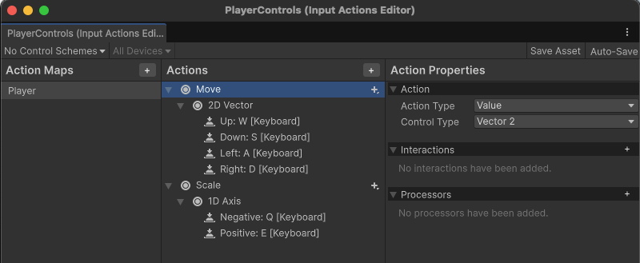
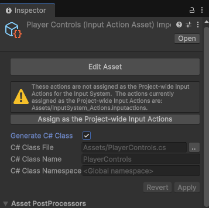

<div>

# Distributed Simple Player Demo - Unity P2P Plugin First Example #

<div id="hide_on_load">

## Interactive README

<b><a href="https://blainebell.org/P2PSimplePlayer/README.html" target="_blank">An interactive version of this page</a></b> is available online.  Code blocks in the implementation section are interactive and show the related code from the psuedo-code in a split screen on the left.
</div>

## Overview

The Simple Player Demo is the easiest way to build a quick example that demonstrates the Unity Peer-to-Peer Networking Plugin. This demo shows how you can setup peer-to-peer logic with P2P components and without any P2P-specific scripting.  The P2P Network Transform object allows each peer to create and distribute a player object that is displayed across all of the peers.

This tutorial will guide you through implementing and understanding the demo, serving as a foundation for building more complex peer-to-peer multiplayer experiences.

### Demo Features

#### Core Functionality

- **Distributed Object Creation**: Create a capsule that represents a player and instantly appears on all devices
- **Interactive Manipulation**: Keyboard WASD or Arrows moves the peer's player on the ayer2D plane
- **Real-time Synchronization**: All movements and changes are synchronized across devices instantly
- **Cross-platform Support**: Works seamlessly across desktops, needs Input System for mobile/XR platforms 

#### Visual Elements

- **Plane**: Plane represents the shared space that shows all players
- **Player Capsules**: Capsules shown on a plane horizontally represent each peer's player
- **Smooth Movement**: The P2P Network Transform distributes/syncronizes GameObject transform changes

---

## Prerequisites

Before starting this demo, ensure you have:

1. **Unity P2P Plugin Installed**: Follow the Getting Started guide in the main documentation
2. **License Configured**: Your P2P Plugin license must be verified
3. **Development Environment**: Either Multiplayer Play Mode or multiple Unity instances/builds
4. **Basic Unity Knowledge**: Familiarity with GameObjects, components, new input system and  basic scripting

To use this demo project, you can download or clone it, load it into Unity (make sure you ignore the errors) before you install the plugin from the Package Manager.

## Project Setup

### 1. Scene Preparation

The demo project has a very simple setup:

```
P2PSimplePlayer
├── Main Camera
├── Directional Light
└── P2PNetworkManager
└── GroundPlane
└── PlayerCapsuleParent
    └── PlayerCapsule
```

### 2. Node/Component Setup

The demo consists these GameObject configurations and one simple script:

- **P2PNetworkManager** - This is an empty game object with the P2P Plugin component added.  This is the main entry point for the peer-to-peer plugin.  It allows for license verification and the control of plugin parameters.
- **GroundPlane** - Default 3D GameObject created as a Plane.
- **PlayerCapsule** - The GameObject that represents the Player capsule.  It has a rotation and translation to position the capsule horizontally to show direction.
- **PlayerCapsuleParent** - Is the parent of **PlayerCapsule** and allows the user to control the position and broadcasts it to all other nodes.  There are three components configured in this GameObject node:
  - **P2P Network Transform** - The plugin's component that allows the distribution of the transform to all peers.  It also creates a prefab object for the remote players. The prefab is the same as the **PlayerCapsuleParent** GameObject except that it doesn't have the **Player Movement** script.
  - **Rigidbody** - This is needed for the **Player Movement** component to control the position of the player.
  - **Player Movement** - This is a script component uses the input control to allows users to control the position of the player using the keyboard (WASD)<a href="Assets/Scripts/PlayerMovement.cs" id="linktop2pdemo" class="viewer-link language-csharp"> **`Assets/Scripts/PlayerMovement.cs`**</a>

#### Input Controls

The *Player Movement* script depends on the **New Input System**, which can be configured by creating an Input Action Asset in your Assets folder named `PlayerControls` and configured like this:

<div style="width: 50%; margin: auto;">
<center>



</center>
</div>

<table style="border: none;width:100%; margin: auto;">
<tr style="border: none;">
<td style="border: none;">

<small style="display: block; margin: 0 0 0 20px; line-height: 1.4;">

1. **Add an Action Map** called `Player` — this will group together all the player-related controls.
2. Within the map, **create a new Action** named `Move`.
    - Set its **Action Type** to **Value**.
    - Set its **Control Type** to **Vector2**.
    - Add a **2D Composite** and assign the **W**, **A**, **S**, **D** keys to **Up**, **Left**, **Down**, **Right** respectively — this allows for smooth directional movement using the keyboard.
3. Next, **add another Action** called `Scale` to control the player’s size.
    - Set its **Action Type** to **Value**.
    - Set its **Control Type** to **Axis (1D)**.
    - Add matching keyboard bindings (for example, **Q/E** or **Minus/Plus**) to increase or decrease scale.

When complete, your Input Actions layout should show both the **Move (2D Vector)** and **Scale (1D Axis)** actions under the **Player** Action Map — ready for use in your movement and size-control scripts.

</small>
</td><td style="border: none; width: 35%;">

<table style="border: none; width: 100%; margin: auto;>
<tr style="border: none;">
<td style="border: none;">



</td>
</tr>
<tr style="border: none;">
<td style="border: none;">
<small style="display: block; margin: 0 0 0 0px; line-height: 1.4;">
Make sure to set the `PlayerControls` to automatically generate the C# class.
</small>
</td>
</tr>
</table>

</td>
</tr>
</table>

#### Hooking up Input Controls
added to the  to that uses these 
Now that the input actions are set up, the <b><a href="Assets/Scripts/PlayerMovement.cs" id="linktop2pdemo" class="viewer-link language-csharp">PlayerMovement.cs</a></b> script, which is added to the <b>PlayerCapsuleParent</b>,  uses these controls to modify the parent object’s transform.  Pseudo-code with links to the code to explain how this script is implemented:

<style>


mark {
  display: block;
  margin: 0;
  padding: 0;
 background-color: white !important;
}

</style>

<pre style="width: fit-content;"><code class="language-csharp">public class PlayerMovement : MonoBehaviour
{
</code></pre>

<div id="presection" style="width: fit-content;">
<mark style="margin: 0;" data-id="membervariables">
<pre class="hl" href="Assets/Scripts/PlayerMovement.cs" highlight="range-7-13"><code class="language-csharp">    /* Parameters to control player movement */
    public float moveSpeed = 5f;
    public float rotationSpeed = 1f;
    public float scaleSpeed = 1f;</code></pre></mark><mark style="margin: 0;" data-id="initStartControls"><pre class="onRelease hl" href="Assets/Scripts/PlayerMovement.cs" highlight="range-15-33"><code class="language-csharp">	void Awake(){
	    initialize and start listening to controls
	}
	void OnEnable() {
	    enable controls
	}
	void OnDisable() {
	    disable controls
	}</code></pre></mark><mark style="margin: 0;" data-id="fixedUpdate"><pre class="FixedUpdate hl" href="Assets/Scripts/PlayerMovement.cs" highlight="FixedUpdate"><code class="language-csharp">    void FixedUpdate(){
        apply control changes to existing transform
    }</code></pre>
</div>

<pre style="width: fit-content;"><code class="language-csharp">}</code></pre>

#### Setting up the Player Prefab and configuring the P2P Network Transform

One final and essential step in this demo is to define and set the player prefab in the **P2P Network Transform** component that will be spawned on remote peers during the peer-to-peer session. This ensures that every connected peer can instantiate and synchronize the remote player object across the network.

1. **Create a Resources Folder**
In the **Assets** directory, create a new folder named **Resources**. Unity uses this folder for assets that can be dynamically loaded at runtime.

2. **Save the Player as a Prefab**
Drag the **player’s parent GameObject** (the one containing the `P2PNetworkTransform` and other related components) into the Resources folder. Unity will automatically create a new prefab asset from it.

3. **Rename the Prefab**
Give the prefab a clear, descriptive name such as **PlayerCapsulePrefab** to make it easy to reference later.

4. **Clean Up Local-Only Components**
Remove the **Player Movement Script** from the prefab. This script should only run on the local peer controlling the player and not on remote instances.

5. **Assign the Prefab to the Network Component**
Finally, drag the newly created prefab onto the **Prefab For Spawning Remote Objects** parameter field of the `P2PNetworkTransform` component on the PlayerCapsuleParent GameObject. This tells the plugin which prefab to spawn for remote players when new peers connect.

After completing these steps, your setup will be ready to instantiate synchronized player capsules across all connected peers, enabling a fully functional multiplayer demonstration.

---

### 3. Running the Demo

Before running the demo, set up multiple peers — either by using **Multiplayer Play Mode** within Unity or by launching **separate instances** of the project on different machines or editor sessions. This allows you to observe synchronization across peers in real time.

Once everything is configured, press **Play** to run the demo. You’ll see that the simple peer-to-peer setup is now complete: each peer independently controls its own player, and all player movements are smoothly synchronized across every connected instance.


Here is a video that explains how to setup this P2P Simple Player example:

<div style="width: 60%; position:relative; margin: auto;">
<center>

<iframe
  width="560"
  height="315"
  src="https://www.youtube.com/embed/1Rh5uQRVBzw"
  title="YouTube video player"
  frameborder="0"
  allow="accelerometer; autoplay; clipboard-write; encrypted-media; gyroscope; picture-in-picture; web-share"
  allowfullscreen
></iframe>

</center>
</div>


</div>
